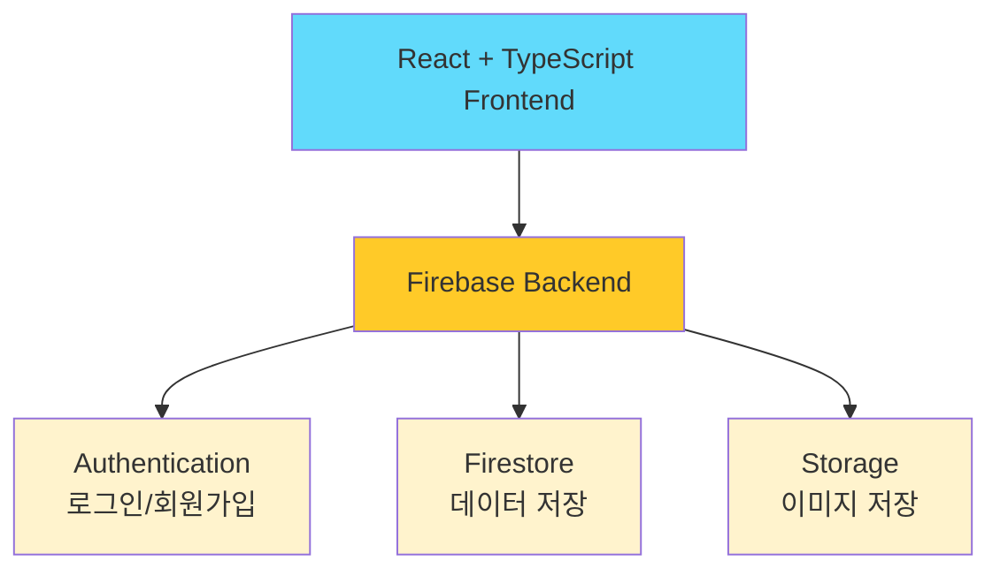

## ✨ 소개 
친구들과 함께 날짜별 테마에 맞춰 사진을 공유하며 추억을 만드는 어드벤트 캘린더 웹 애플리케이션


### 🎯 프로젝트 동기

- 크리스마스 어드벤트 캘린더에서 영감을 받아 크리스마스에 사용하기 위해 개발
- 친구와 특별한 기간 동안 매일 사진을 공유하며 추억 만들기
- 단순한 사진 공유를 넘어 테마에 맞는 사진을 고르며 재미있는 경험 제공

### 📅 기간

- [x]  개발: 2025.11.25 - 2025.12.01 (1주)
- [x]  배포: 2025.12.01
- [ ]  알파테스트: 2025.12.01 - 2025.12.25 (3주)
- [ ]  베타테스트: 2025.12.26 - 2026.01.01 (4주)

### 👤 개발 인원

1인 (개인 프로젝트)

### 🔗 링크

- **배포 URL**: [https://advent-calendar-68497.web.app](https://advent-calendar-68497.web.app/)

---
## ✨ 주요 기능

### 인증 시스템

- Google 소셜 로그인
- Firebase Authentication 기반 안전한 인증
- 사용자 프로필 자동 동기화

### 프로젝트 관리

- **프로젝트 생성**
    - 기간 설정 (시작일/종료일 중 하나만 선택 시 자동 계산)
    - 테마 설정 (기본 테마)
- **프로젝트 목록**
    - 사용자가 멤버인 프로젝트만 보여짐
    - D-Day 카운트, 진행률 표시
    - 카드 형태 UI

### 이미지 관리

- **날짜별 이미지 업로드**
    - 오늘 또는 과거 날짜만 업로드 가능 (미래 날짜 잠금)
    - Firebase Storage 연동
- **이미지 뷰어**
    - 모달 형태로 구현
    - 여러 이미지 슬라이드 (화살표)
    - 업로드 정보 표시 (사용자, 날짜)
- **이미지 삭제**
    - 본인이 올린 이미지만 삭제 가능

### 협업 기능

- **프로젝트 초대**
    - 고유한 초대 링크 생성
    - 링크 복사
    - 초대 받은 사용자 자동 멤버 추가

---
## 🛠️기술 스택

### Frontend

- React 19 (TypeScript)
- React Router DOM v7
- Tailwind CSS v3.4.18
- shadcn/ui

### Backend & Infrastructure

- Firebase Authentication (Google)
- Firestore Database (NoSQL Database)
- Firebase Storage (이미지 저장)

### Development Tools

- Vite (빌드 도구)
- Git & GitHub (형상 관리)
- Firebase Hosting (배포)

### 해당 기술들 선택 이유
>사용을 위해 궁극적으로 짧은 기간에 배포 완료까지 필요한 프로젝트여서 빠르게 개발할 수 있는 기술을 선택

- **React + TypeScript**: 타입 안정성으로 에러 최소화
- **Firebase**: 짧은 기간 내 개발하기 위해 서버리스 개발이 가능한 백엔드 서비스 플랫폼 활용
- **Tailwind CSS**: 유틸리티 기반으로 빠른 스타일링, 반응형 디자인
- **Vite**: 최근 활발히 사용, 빠른 개발 서버, Hot Module Replacement

---
## 아키텍처 & 데이터 구조

### ⚙️ 전체 시스템 아키텍처



### 📊 Firestore 데이터 구조

```tsx
📁 Firestore Database
│
├─ 📂 users/
│  └─ 📄 {uid}/
│     ├─ uid: string
│     ├─ email: string
│     ├─ displayName: string
│     ├─ photoURL: string
│     ├─ createdAt: timestamp
│     └─ updatedAt: timestamp
│
└─ 📂 projects/
   └─ 📄 {projectId}/
      ├─ title: string
      ├─ createdBy: string
      ├─ members: string[]
      ├─ startDate: timestamp
      ├─ endDate: timestamp
      ├─ totalDays: number
      ├─ createdAt: timestamp
      │
      ├─ 📂 days/
      │  └─ 📄 {dayNumber}/
      │     ├─ dayNumber: number
      │     ├─ theme: string
			│     ├─ themeIndex: number
			│		  ├─ isOpened: boolean //결국 사용하지 않는 field
      │     └─ date: timestamp
      │
      └─ 📂 images/
         └─ 📄 {imageId}/
            ├─ projectId: string
            ├─ dayNumber: number
            ├─ userId: string
            ├─ userName: string
            ├─ imageUrl: string
            ├─ storagePath: string
            └─ uploadedAt: timestamp
```

### 🗂️ 폴더 구조

```
src/
├── components/      # 재사용 가능한 UI 컴포넌트
│   ├── auth/       # 인증 관련
│   ├── layout/     # 레이아웃(헤더 등)
│   └── project/    # 프로젝트 관련
├── pages/          # 라우트 페이지
├── firebase/       # Firebase 로직 분리
├── hooks/          # Custom Hooks
├── constants/      # 변하지 않는 값(기본 테마)
└── types/          # TypeScript 타입 정의
```

---
## 추가 개발 예정 기능 사항
- [x] 주제 직접 입력 기능
- [ ] 프로젝트 삭제 기능
- [ ] 전체 진행 일자 사용자 설정 기능
- [ ] 프로젝트 멤버 관리 기능
- [ ] 내 정보 수정 기능
