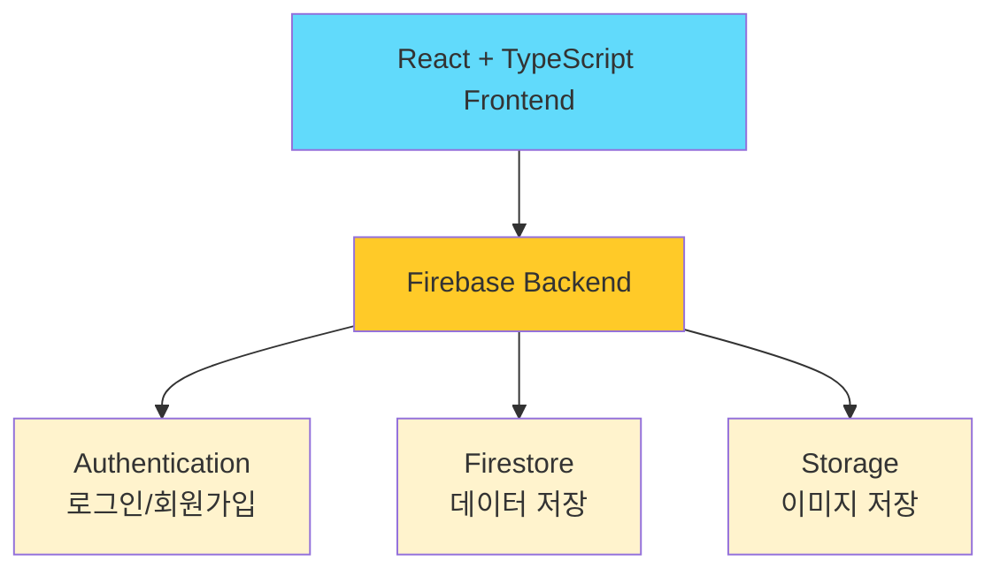

## ✨ 소개 
친구들과 함께 날짜별 테마에 맞춰 사진을 공유하며 추억을 만드는 어드벤트 캘린더 웹 애플리케이션

### 🎯 프로젝트 동기

- 크리스마스 어드벤트 캘린더에서 영감을 받아 크리스마스에 사용하기 위해 개발
- 친구와 특별한 기간 동안 매일 사진을 공유하며 추억 만들기
- 단순한 사진 공유를 넘어 테마에 맞는 사진을 고르며 재미있는 경험 제공

### 📅 기간

- 개발: 2025.11.25 - 2025.12.01
- 배포: 2025.12.01
- 유지보수: 2025.12.01 - 현재

### 👤 개발 인원

1인 (개인 프로젝트)

### 🔗 링크

- **배포 URL**: [https://advent-calendar-68497.web.app](https://advent-calendar-68497.web.app/)

---
## ✨ 주요 기능

### 인증 시스템

- Google 소셜 로그인
- Firebase Authentication 기반 안전한 인증
- 사용자 프로필 자동 동기화
- Context/Provider 패턴 기반 전역 인증 상태 관리
- 라우팅 가드 (비로그인 사용자 프로젝트 페이지 접근 차단)
- 로고 애니메이션 전역 로딩 화면

### 프로젝트 관리

- **프로젝트 생성**
    - 기간 설정 (시작일/종료일 중 하나만 선택 시 자동 계산)
    - 테마 설정 (기본 테마)
- **프로젝트 목록**
    - 사용자가 멤버인 프로젝트만 보여짐
    - D-Day 카운트, 진행률 표시
    - 카드 형태 UI

### 이미지 관리

- **날짜별 이미지 업로드**
    - 오늘 또는 과거 날짜만 업로드 가능 (미래 날짜 잠금)
    - Firebase Storage 연동
- **이미지 뷰어**
    - 모달 형태로 구현
    - 여러 이미지 슬라이드 (화살표)
    - 업로드 정보 표시 (사용자, 날짜)
- **이미지 삭제**
    - 본인이 올린 이미지만 삭제 가능

### 협업 기능

- **프로젝트 초대**
    - 고유한 초대 링크 생성
    - 링크 복사
    - 초대 받은 사용자 자동 멤버 추가

---
## 🛠️기술 스택

### Frontend

- React 19 (TypeScript)
- React Router DOM v7
- Tailwind CSS v3.4.18
- shadcn/ui
- TanStack Query v5 (서버 상태 관리)

### Backend & Infrastructure

- Firebase Authentication (Google)
- Firestore Database (NoSQL Database)
- Firebase Storage (이미지 저장)

### Development Tools

- Vite (빌드 도구)
- Git & GitHub (형상 관리)
- Firebase Hosting (배포)
- GitHub Actions (CI/CD: Firebase 자동 배포, AI PR 코드 리뷰)

### 해당 기술들 선택 이유
>사용을 위해 궁극적으로 짧은 기간에 배포 완료까지 필요한 프로젝트여서 빠르게 개발할 수 있는 기술을 선택

- **React + TypeScript**: 타입 안정성으로 에러 최소화
- **Firebase**: 짧은 기간 내 개발하기 위해 서버리스 개발이 가능한 백엔드 서비스 플랫폼 활용
- **Tailwind CSS**: 유틸리티 기반으로 빠른 스타일링, 반응형 디자인
- **Vite**: 최근 활발히 사용, 빠른 개발 서버, Hot Module Replacement

---
## 아키텍처 & 데이터 구조

### ⚙️ 전체 시스템 아키텍처


```mermaid
graph TD
    A[React + TypeScript Frontend] --> B[Firebase Backend]
    
    B --> C[Authentication<br/>로그인/회원가입]
    B --> D[Firestore<br/>데이터 저장]
    B --> E[Storage<br/>이미지 저장]
    
    style A fill:#61dafb
    style B fill:#ffca28
    style C fill:#fff3cd
    style D fill:#fff3cd
    style E fill:#fff3cd
    

```

### 📊 Firestore 데이터 구조

```tsx
📁 Firestore Database
│
├─ 📂 users/
│  └─ 📄 {uid}/
│     ├─ uid: string
│     ├─ email: string
│     ├─ displayName: string
│     ├─ photoURL: string
│     ├─ createdAt: timestamp
│     └─ updatedAt: timestamp
│
└─ 📂 projects/
   └─ 📄 {projectId}/
      ├─ title: string
      ├─ createdBy: string
      ├─ members: string[]
      ├─ startDate: timestamp
      ├─ endDate: timestamp
      ├─ totalDays: number
      ├─ isCustomTheme: boolean
      ├─ createdAt: timestamp
      │
      ├─ 📂 days/
      │  └─ 📄 {dayNumber}/
      │     ├─ dayNumber: number
      │     ├─ theme: string
	  │     ├─ themeIndex: number
	  │		├─ isOpened: boolean //결국 사용하지 않는 field
      │     └─ date: timestamp
      │
      └─ 📂 images/
         └─ 📄 {imageId}/
            ├─ projectId: string
            ├─ dayNumber: number
            ├─ userId: string
            ├─ userName: string
            ├─ imageUrl: string
            ├─ storagePath: string
            └─ uploadedAt: timestamp
```

### 🗂️ 폴더 구조

```
src/
├── components/      # 재사용 가능한 UI 컴포넌트
│   ├── auth/       # 인증 관련 (LoginForm, LoginModal)
│   ├── layout/     # 레이아웃 (Header, GlobalLayout, GlobalLoader)
│   └── project/    # 프로젝트 관련
├── pages/          # 라우트 페이지
├── context/        # React Context (AuthContext)
├── provider/       # Context Provider (AuthProvider)
├── firebase/       # Firebase 로직 분리
├── hooks/          # Custom Hooks
│   ├── queries/    # TanStack Query 쿼리 훅
│   └── mutations/  # TanStack Query 뮤테이션 훅
├── lib/            # 유틸리티 (utils, browserDetect, constants)
├── constants/      # 변하지 않는 값(기본 테마)
├── types/          # TypeScript 타입 정의
├── App.tsx         # 라우터 설정
└── RootRoute.tsx   # 최상위 라우트 (인증 가드, 레이아웃)
```

---

## 트러블슈팅 & 리팩토링
- [[CICD] PR을 올리면 AI가 코드 리뷰를 해주는 워크플로우 도입](https://velog.io/@melcoding/ci-cd-pr-ai-review)
- [[리팩토링] React Context 패턴으로 인증 리팩토링](https://velog.io/@melcoding/refactoring-react-context-auth)
- [[트러블슈팅] Firebase 멀티호스팅 리다이렉트 로그인 오류 완벽 해결](https://velog.io/@melcoding/troubleshooting-firebase-redirect-login)
- [[트러블슈팅] 로그아웃 후 뒤로가기 방지 및 리다이렉트 무한 로딩 해결](https://velog.io/@melcoding/troubleshooting-route-guard-problem)
- [[리팩토링] Advent Calendar 검색엔진 최적화(SEO)](https://velog.io/@melcoding/advent-calendar-seo)
- [[리팩토링] Advent Calendar 번들 최적화로 모바일 메인 로딩 시간 단축](https://velog.io/@melcoding/refactoring-advent-calendar-bundle-size-optimization)
- [[트러블슈팅] 이미지 모달 높이 고정으로 긴 이미지 사용성 개선](https://velog.io/@melcoding/troubleshooting-image-modal-size)
- [[트러블슈팅] 카카오톡 브라우저 감지 로직 위치로 인한 접근 차단 문제](https://velog.io/@melcoding/troubleshooting-kakao-browser-detect-location)
- [[트러블슈팅] Firestore 프로젝트 삭제 시 관련 데이터 정리 누락 해결](https://velog.io/@melcoding/firestore-delete-project)
- [[트러블슈팅] 카카오톡 인앱 브라우저에서 구글 OAuth 로그인 차단 문제 해결](https://velog.io/@melcoding/kakaotalk-in-app-google-OAuth)
- [[트러블슈팅] Firebase Authentication 리다이렉트 로그인 시 로그인되지 않고 초기 화면으로 돌아가는 문제 해결](https://velog.io/@melcoding/sign-in-redirect-problem)
- [[트러블슈팅] Firebase Authentication 팝업 로그인 시 Cross-Origin-Opener-Policy(COOP) 오류](https://velog.io/@melcoding/troubleshooting-google-popup-COOP)
- [[트러블슈팅] import.meta.env.MODE](https://velog.io/@melcoding/import.meta.env.MODE)
- [[트러블슈팅] Firebase 함수와 타입을 분리하여 Import](https://velog.io/@melcoding/troubleshooting-typescript-function-type)
---

## 추가 개발 완료
- [x] 주제 직접 입력 기능
- [x] 프로젝트 삭제 기능
- [x] 이미지 하단에 이미지 올린 사용자명 추가
- [x] 전체 진행 일자 사용자 설정 기능
- [x] TanStack Query 도입으로 데이터 페칭 리팩토링 (선언적 서버 상태 관리, 캐시 기반 중복 요청 방지)

## 추가 개발 예정 기능 사항
- [ ] 이미지 올리기 선택한 위치에 표시
- [ ] 프로젝트 멤버 관리 기능
- [ ] 내 정보 수정 기능
---

## 성과

- **사용자 피드백 기반의 점진적 개선:** 실제 사용자(친구)의 VOC를 수집하고 이를 분석하여, 1주일 단위의 빠른 배포 사이클을 통해 기능을 고도화하는 **애자일 운영 프로세스** 경험
- **체계적인 형상 관리 및 버전 전략:** 1인 프로젝트임에도 **Git Conventional Commits** 규격과 기능 단위 브랜치 전략을 엄격히 준수하여, 추후 협업이나 확장이 용이한 **투명한 히스토리 관리** 체계 구축
- **서버리스 기반 인프라 효율화:** Firebase를 활용한 서버리스 아키텍처를 설계하여, 인프라 관리 비용을 최소화하고 **프론트엔드 비즈니스 로직 최적화에 집중**할 수 있는 개발 환경 조성
- **타입 안정성 확보를 통한 품질 관리:** TypeScript를 전면 도입하여 컴포넌트 간 데이터 흐름을 규격화하고, **런타임 에러를 사전에 차단하는 안정적인 코드 베이스** 확보
- **CI/CD 파이프라인 자동화:** GitHub Actions로 Firebase 자동 배포 워크플로우를 구성하고 dev/prod 환경을 분리하여, PR마다 테스트 URL을 자동으로 댓글로 제공하는 **배포 자동화 체계** 구축
- **AI 기반 코드 리뷰 자동화:** OpenAI API를 GitHub Actions에 통합하여 PR 생성 시 자동으로 코드 리뷰를 수행하는 워크플로우를 도입, **코드 품질 관리를 자동화**하는 개발 환경 구성
- **성능 최적화 수치화:** 번들 최적화(코드 스플리팅, 불필요 의존성 제거)와 SEO 메타 태그 추가를 통해 **모바일 초기 로딩 성능 개선 및 검색 엔진 노출** 확보
---

## 배운 점

**1. 기술적 성장: 구조적 설계의 중요성**

- **데이터 모델링의 프로세스화:** NoSQL(Firestore) 환경에서 데이터 간의 관계를 구조화하며 **DB 설계 프로세스** 습득
- **컴포넌트 아키텍처 설계:** React 19와 TypeScript를 결합하여 재사용 가능하고 독립적인 컴포넌트 단위를 설계하며 **모듈화된 개발 프로세스** 이해

**2. 개발 프로세스: 선(先) 설계, 후(後) 구현의 중요성**

- **타입 중심의 개발 워크플로우:** 무작정 코드를 짜기보다 **타입을 먼저 정의**하고 인터페이스를 맞추는 과정이 전체 개발 속도와 정확도를 비약적으로 높인다는 것을 체감
- **문제 해결의 체계화:** 인앱 브라우저 인증 이슈 등 기술적 난제 발생 시, 임시방편이 아닌 근본 원인을 분석하고 이를 **기술 블로그에 문서화**하여 지식을 자산화하는 습관 형성

**3. UX 역량: 제약을 통한 사용자 가치 창출**

- **목적 중심의 기능 제한:** "오늘/과거 날짜만 업로드 가능"과 같은 의도적인 기능 제한 프로세스를 통해, 서비스 본연의 가치(어드벤트 캘린더의 설렘)를 유지하는 **UX를 고민하는** 역량 강화

**4. 인프라 역량: 환경 분리와 배포 자동화**

- **dev/prod 환경 분리:** Firebase 멀티호스팅을 활용해 개발 환경과 운영 환경을 명확히 분리하고, PR마다 독립적인 테스트 URL을 제공함으로써 **안전한 변경 검증 프로세스** 체득
- **CI/CD 자동화의 실질적 가치:** 배포 자동화가 단순한 편의를 넘어 **릴리즈 품질 안정성과 개발 집중도**를 높인다는 것을 직접 경험

**5. AI 도구 활용: 개발 워크플로우 고도화**

- **AI 코드 리뷰 도입:** OpenAI API와 GitHub Actions를 연동하여 PR 자동 코드 리뷰를 구현하는 과정에서, **외부 API 통합과 워크플로우 설계** 역량 습득
- **도구로서의 AI 활용:** AI 리뷰를 통해 놓치기 쉬운 코드 품질 이슈를 사전에 발견하고, **인간 리뷰와 AI 리뷰의 역할 분담**에 대한 실용적 관점 형성
